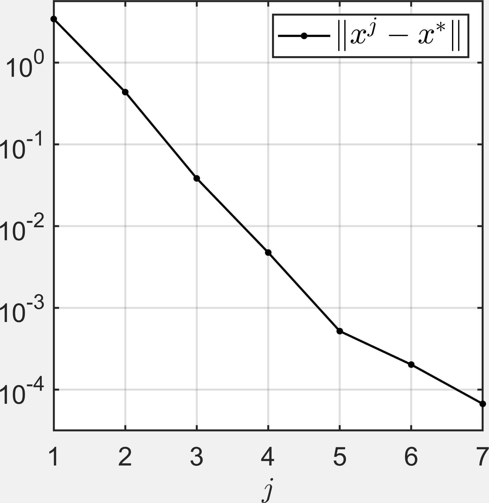
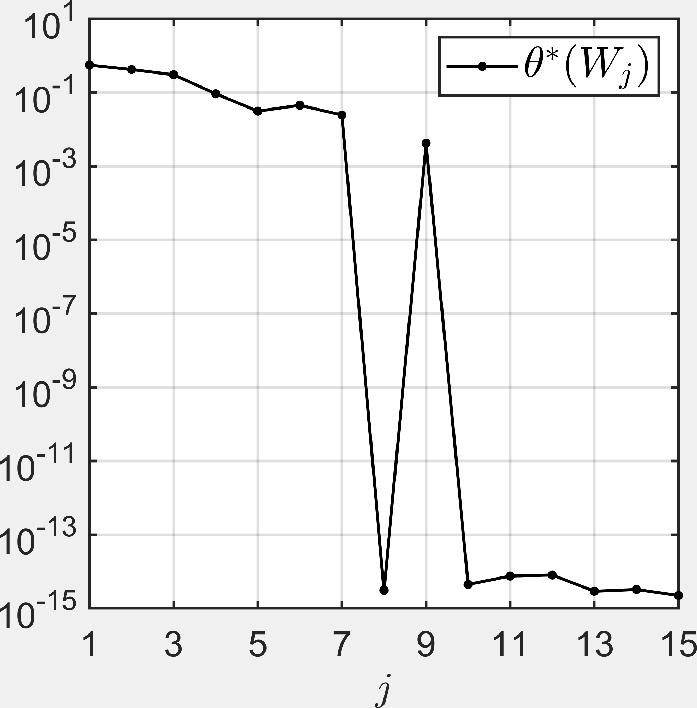
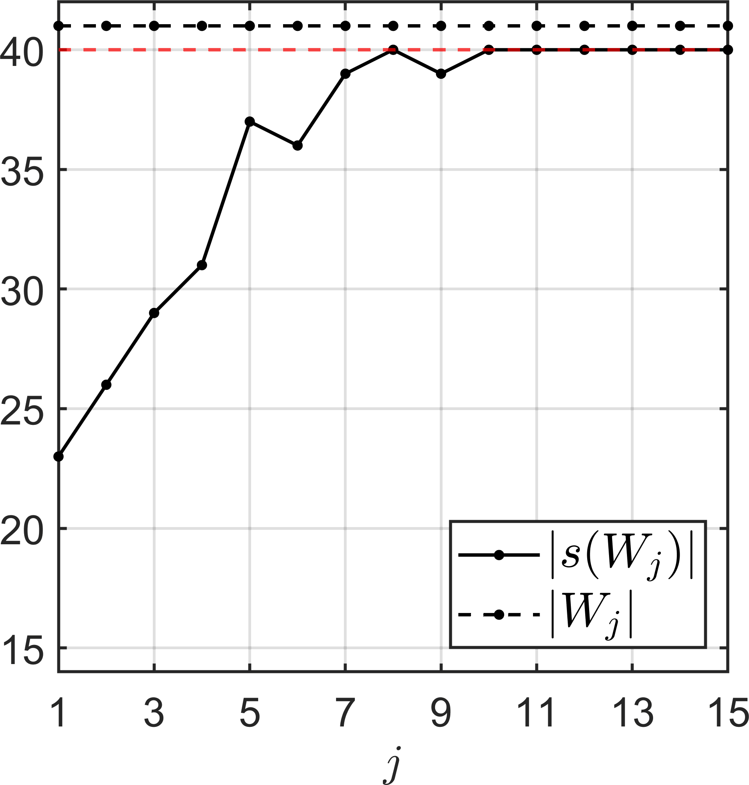

# Experiments on bundling for higher-order cutting-plane models

In [1], a higher-order trust-region bundle method was derived that achieves superlinear convergence of serious steps for $\text{lower-}C^2$ functions with polynomial growth. While the bundling mechanism (Alg. 4.1 in [1], performing the "null steps") that was used for this is relatively efficient in terms of oracle calls, it is not efficient in terms of runtime. (The reason for this is the fact that a nonconvex non-quadratic subproblem has to be solved for each null step.) The experiments in this repository show that there is an alternative, more time-efficient way of computing the bundles required for performing superlinear steps in case the objective is a finite max-type function. The idea is to combine the exploratory nature of gradient sampling methods (as observed in [2], Thm. 52) with an improved error estimate for higher-order cutting-plane models. A draft of the related theory is contained in Draft_Theoretical_background.pdf. In addition to gradient sampling, the improved error estimate suggests that any bundling mechanism that explores the nonsmooth structure well enough can potentially be used for computing apropriate bundles. We demonstrate this by testing BFGS, which is known to have exploratory properties (see, e.g., [3], Remark 20, and [5], Section 4), for computing the bundle.   

In the following sections, we briefly describe the numerical experiments.

## Bundling via Goldstein $\varepsilon$-subgradients

We first focus on the bundling behavior of small $\varepsilon$-subgradients (without subsequent superlinear steps). Let $f$ be the objective function and $x^{* }$ be a minimum. In the draft for the theory, it is shown that a small $\varepsilon$-subgradient sampled at points $W$ close to $x^{* }$ corresponds to a set of gradients for which the corresponding set $S' = s(W)$ of selection functions induces a function $F_{S'} := \max_{s \in S'} f_s$ for which the minimum $x^{* }$ is a critical point. In the following, we analyze this property in numerical experiments. As a measure of criticality of $x^{* }$ for the function $F_{s(W)}$, we use the value 
$$\theta^{* }(W) := \min(\\| \mathrm{conv}(\\{ \nabla f_s(x^*) : s \in s(W)\\} ) \\|)$$.
For computing mall $\varepsilon$-subgradients, we use the deterministic gradient sampling method (DGS) from https://github.com/b-gebken/DGS. Given sequences $(\varepsilon_j)\_j$ and $(\delta_j)\_j$, it computes a sequence  $x$ such that the element with the smallest norm in $\\partial f_{\varepsilon_j}(x_j)$ has norm less or equal $\delta_j$.

As a start, we consider the function (8.4) from [5] for $n = 50$ and $k = 40$.

  
  
  
   
  <strong>Figure 1.</strong>

The left plot shows that $(x^j)\_j$ converges to $x^{* }$. The middle plot shows that for $j$ large enough, the method correctly finds a set of selection functions for which $x^{* }$ is a critical point. The right plot shows the number of sample points and the number of selection functions that were found in each iteration $j$. Since $k = 40$, we see that the algorithm actually finds all selection functions for $j$ large enough.

## References

[1] Gebken, B., Ulbrich, M.: Superlinear convergence in nonsmooth optimization via higher-order cutting-plane models. (2026). https://arxiv.org/abs/2603.23236 \
[2] Han, X.Y.: Blackbox optimization, Nonsmooth Structure, and Survey Descent. PhD thesis, Cornell University Library (2023). https://doi.org/10.7298/4RRV-8H61 \
[3] Han, X.Y., Lewis, A. S.: Survey Descent: A Multipoint Generalization of Gradient Descent for Nonsmooth Optimization. SIAM J. OPTIM (2023). https://doi.org/10.1137/21M1468450 \
[4] Gebken, B.: Technical results on the convergence of quasi-Newton methods for nonsmooth optimization. (2026). https://arxiv.org/abs/2511.03296 \
[5] Lewis, A., Wylie, C.: A simple Newton method for local nonsmooth optimization. (2019). https://arxiv.org/abs/1907.11742 \
